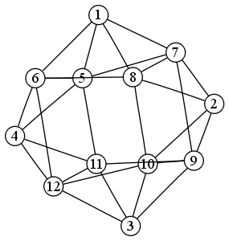

The problem
===========

[sec-1]

I want to have a format that I can convert to `pdf, html`, and maybe `odt`. The formats I know well are

-   LaTeX

-   org

One thing I like about org is that it is rather simple, and the documents look clean. I do not like that it seems to change constantly and that it is not as universally known as LaTeX.

I want to use:

-   links, say [Google](http://google.com).

-   images, say

    [htb] 

    Apparently one has to have a blank line so that the image looks OK. Also, with a caption, the image is centered both in LaTeX and HTML export.

-   code, say

        def test(a):
            """This is just a test

            Arguments:
            - `a`: test argument
            """

-   math symbols, say \(a^{2}+b^{2}=c^{2}\)

-   displayed equations, like:

    \[a^{2}+b^{2}=c^{2}\]

-   theorems, definitions, etc.

-   references, to a bibliographic resource or to another theorem previously stated.

Resources
=========

[sec-2]

In emacs
--------

[sec-2-1]

-   `org-mode` can export to several formats

